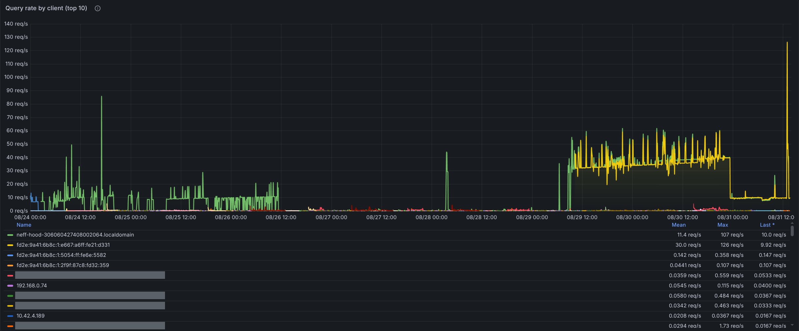
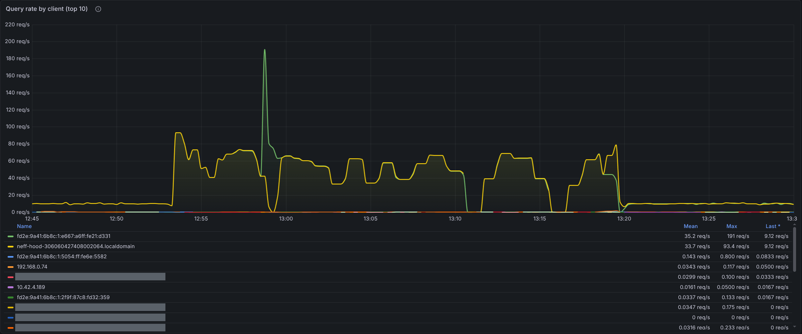
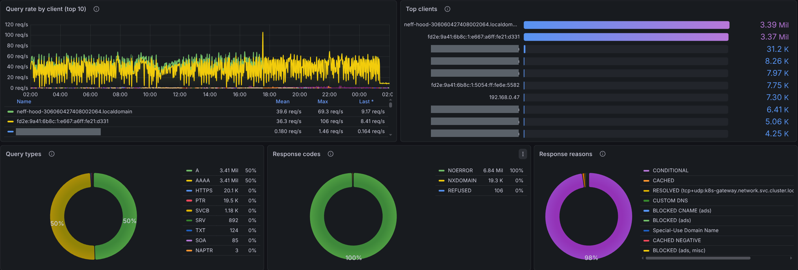
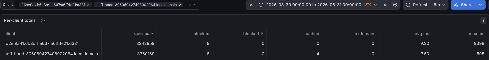
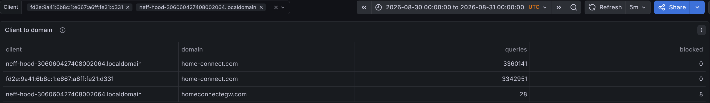
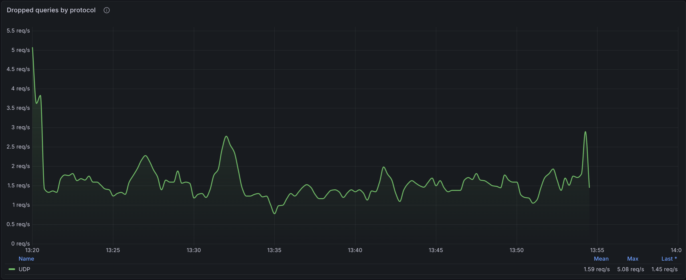

# Neff extractor hood floods the local resolver with ~100 identical DNS queries per second

Measured on a private home network between 24 and 31 August 2026. This document records observed
behaviour and measurement method only. It does not state a cause: we have no visibility into the
appliance's software, and we make no claim about why the pattern occurs.

**Formatted version of this report:** <https://xnilsit.github.io/neff-hood-dns-report/>

## Appliance

| | |
|---|---|
| Appliance | Neff extractor hood, Home Connect module |
| E-Nr. | `D85IFN1S0/06` |
| Z-Nr. | `00206` |
| FD-Nr. | `0606` |
| Serial number | `306060427408002064` |
| Version | `6.1-5.19.0.11 (6.4)` |
| SW version (device) | `2444479` |
| RED label version | `16788.0.2444479` |
| DHCP / mDNS client name | `neff-hood-306060427408002064` |
| IPv4 address | `192.168.0.25` |
| IPv6 address | `fd2e:9a41:6b8c:1:e667:a6ff:fe21:d331` |
| MAC (derived from EUI-64) | `e4:67:a6:21:d3:31` |
| Query name | `global.time.appliances.home-connect.com` |
| Resolver observed on | blocky v0.34.0, 3 instances |
| Report date | 2026-08-31 |

Appliance identification as shown in the Home Connect app on 31 August 2026. The client name the
appliance announces on the network carries the same serial number, which is how its traffic was
attributed.

## In four numbers

| | |
|---|---|
| **85.9 q/s** | Mean query rate from this one appliance with no rate limiting, 13-minute window |
| **6 792 969** | Queries counted from it on 30 August 2026 (00:00–24:00 UTC) |
| **97.6 %** | Share of all DNS queries on the network in the last 24 h |
| **300 s** | TTL of the record it re-requests roughly 21 times per second |

## 0 · How DNS reaches the appliance and back

The appliance is on an ordinary home LAN, `192.168.0.0/24`, behind a single router that provides
DHCP and internet access. There is one resolver for the whole network, and every client is pointed
at it by DHCP:

- the appliance sends its queries over plain UDP to port 53 of the resolver address it was given —
  `192.168.1.53`, and since 29 August also `fd2e:9a41:6b8c:1::53`;
- that address is a virtual address served by a small Kubernetes cluster on the same network,
  announced on the LAN by the cluster's network layer and load-balanced across three instances of
  the resolver software (blocky v0.34.0);
- the resolver answers from its own cache where it can. For anything it does not hold, it forwards
  to the router at `192.168.0.1`, which in turn uses its own upstream resolver on the internet.
  Names belonging to the cluster itself go to an internal resolver instead;
- encrypted transports (DNS over TLS on 853) exist on this resolver but are not involved here: the
  appliance uses plain UDP, which is also why the dropped queries in Figure 6 are labelled UDP.

Nothing in that path rewrites or filters what the appliance asks for. The one exception is
deliberate and documented in this report: during measurement condition 2 a resolver rule answered
its query name locally, so that an `AAAA` address could be supplied.

### The cluster was switched to dual-stack on 29 August

Until then the network was IPv4-only from the resolver's point of view. IPv6 was enabled on
29 August at **10:15 UTC**, and the resolver gained the additional address `fd2e:9a41:6b8c:1::53`.
From that minute the appliance appears in the graphs twice — once as `192.168.0.25` and once as
`fd2e:9a41:6b8c:1:e667:a6ff:fe21:d331`, the same network interface — and it has been running its
query loop over both address families at the same rate ever since. This matters when reading the
daily volumes: the roughly twofold step on 29 August is the second address family being added by
us, not the appliance sending faster. The change from intermittent to continuous on the same day is
not explained by it.

## 1 · What the appliance sends

The appliance repeats one single query name, `global.time.appliances.home-connect.com`,
continuously, in four parallel streams:

- type `A` and type `AAAA`, in roughly equal numbers;
- each of those over IPv4 (from `192.168.0.25`) and over IPv6 (from
  `fd2e:9a41:6b8c:1:e667:a6ff:fe21:d331`) — both addresses belong to the same network interface.

Every query is answered. In the measurement windows below there were no timeouts, no `SERVFAIL`,
and no failed upstream lookups; the resolver replied `NOERROR` to 100 % of them, most from its
cache. The appliance nevertheless re-sends the same question within milliseconds.

Separately, and at a negligible rate, the appliance sends about one reverse (`PTR`) query every
20 seconds from each address. Those are answered `NXDOMAIN`. They are noted for completeness and
are not part of the flood.

## 2 · Query rate, per condition

Rates are counted by the resolver itself (Prometheus counter `blocky_query_total`, per client
address and query type). "Per stream" is the aggregate divided by the four streams.

| # | Condition | Window (UTC, 31 Aug unless noted) | Aggregate | Per stream |
|---|---|---|---|---|
| 1 | No rate limiting. Resolver returned the genuine records. | 30 Aug, 20:00, 5 min | **117.4 q/s** | 29.2–29.5 q/s |
| 2 | No rate limiting. Resolver was configured to answer *both* `A` and `AAAA` with addresses, so the appliance received a full answer to every question. | 12:54–12:59 | **109.2 q/s** | ≈27.3 q/s |
| 3 | No rate limiting. Genuine answers again: `A` with two addresses, `AAAA` empty (the zone has no AAAA record). | 13:06–13:19, sampled each minute | **85.9 q/s mean**, 31.5–132.1 q/s range | ≈21.5 q/s |
| 4 | Rate limiting active: 10 q/s per client address, excess queries silently dropped. | 13:24 onwards | 19.9 q/s + ≈1.3 q/s dropped | ≈4.97 q/s |

Conditions 2 and 3 differ only in what the appliance was told about `AAAA`. Supplying an `AAAA`
address did not reduce the rate; it was, if anything, slightly higher. Under condition 4 the
appliance sits exactly at the imposed ceiling continuously — it keeps offering more queries than
the ceiling allows and does not slow down when they go unanswered.

## 3 · How the volume compares to the rest of the network

| Source | DNS queries, last 24 h | Share |
|---|---|---|
| Neff hood (both addresses) | **4 002 742** | 97.6 % |
| Every other client on the network combined (≈40 devices, incl. workstations, phones, servers, other Home Connect appliances) | 97 125 | 2.4 % |

The 24-hour figure for the hood is itself suppressed — rate limiting was active for most of that
period. On 30 August, with no limiting in place, the resolver counted **6 792 969** queries from
this appliance in one day, and **12 702 796** over seven days. The busiest human-operated device on
the network peaked at 5.6 q/s; the hood's unthrottled mean is roughly 15 times that peak, sustained
around the clock.

| Date (UTC) | Queries from the hood | Share of the day above 10 q/s |
|---|---|---|
| 2026-08-24 | 168 880 | 8 % |
| 2026-08-25 | 527 819 | 23 % |
| 2026-08-26 | 330 818 | 26 % |
| 2026-08-27 | 15 376 | 0 % |
| 2026-08-28 | 76 776 | 2 % |
| 2026-08-29 | 3 881 562 | 64 % |
| 2026-08-30 | **6 792 969** | 100 % |
| 2026-08-31 (to 13:00, rate limited) | 1 067 645 | 100 % |

The pattern was intermittent between 24 and 28 August and continuous from 29 August onwards. Two
things to read carefully here: the appliance was not touched at that transition, and part of the
step is ours — IPv6 was enabled on 29 August at 10:15 UTC, after which the same loop is counted
twice, once per address family. Halving the figures from 29 August for that reason still leaves
roughly 1.9 million and 3.4 million queries per day against 15 to 528 thousand in the days before,
so the shift from intermittent to continuous is not a counting effect.

## 4 · The DNS data involved

The name resolves normally. Queried directly at the authoritative name server for the zone:

```
$ dig @ns-214.awsdns-26.com global.time.appliances.home-connect.com A

;; flags: qr aa rd; QUERY: 1, ANSWER: 2, AUTHORITY: 4
;; ANSWER SECTION:
global.time.appliances.home-connect.com. 300 IN A 166.117.100.221
global.time.appliances.home-connect.com. 300 IN A 166.117.209.92
```

```
$ dig @ns-214.awsdns-26.com global.time.appliances.home-connect.com AAAA

;; flags: qr aa rd; status: NOERROR; QUERY: 1, ANSWER: 0, AUTHORITY: 1
;; AUTHORITY SECTION:
appliances.home-connect.com. 900 IN SOA ns-214.awsdns-26.com.
    awsdns-hostmaster.amazon.com. 1 7200 900 1209600 86400
```

- The `A` records carry a TTL of **300 seconds**. The appliance re-requests them roughly 21 times
  per second.
- There is no `AAAA` record for this name. The authoritative answer is an empty `NOERROR` with an
  `SOA` in the authority section, i.e. a negative answer that is cacheable for 900 seconds.
- The appliance queries both types at the same rate regardless.

> To rule out the empty `AAAA` answer as the trigger, we made the local resolver answer `AAAA` for
> this name with a real address for the duration of condition 2 above. The query rate did not fall.
> That is an observation, not an explanation.

## 5 · How this was measured

- The network's only resolver is blocky v0.34.0, three instances behind one service address,
  forwarding to the router. All LAN clients use it via DHCP.
- Counts come from the resolver's own Prometheus metrics (`blocky_query_total`,
  `blocky_response_total`, `blocky_rate_limit_drops_total`), labelled per client address and query
  type, scraped at 30-second intervals and retained in VictoriaMetrics. The per-query log is stored
  separately in TimescaleDB.
- For conditions 2 and 3 the resolver's rate limiter was raised out of the way (2000 q/s) so the
  figures are the appliance's *offered* load, not a throttled figure. The original 10 q/s limit was
  restored afterwards.
- Client identity comes from the appliance's own DHCP/reverse name,
  `neff-hood-306060427408002064`; the IPv6 address is its interface identifier, and the MAC above is
  derived from that EUI-64 (`e667:a6ff:fe21:d331` → `e4:67:a6:21:d3:31`).
- Rates quoted in the table are read from windows that lie entirely after a configuration change had
  taken effect. A rate window spanning a resolver restart over-reports, which is the one spike
  visible in Figure 2.
- The queries observed in condition 2 were answered by a resolver rule that matches this name only.
  That rule accounted for 109.0 of 109.2 q/s in that window, which confirms the appliance's traffic
  is this single query name and nothing else.
- In every screenshot the names of the household's other devices are blanked out for privacy. Their
  query counts, bars and series are untouched.

### Not determined

- Why the appliance behaves this way. We did not capture its traffic at packet level and have no
  access to its software.
- Whether its time synchronisation succeeds or fails, and whether the two are related.
- Whether other units of the same model are affected. We can only report this one appliance, plus
  the fact that the other Home Connect appliances on the same network (dishwasher, hob) query at a
  negligible rate.

## 6 · Evidence

### Figure 1 — DNS query rate per client, 24–31 August 2026



Resolver panel "Query rate by client (top 10)", one week to 31 August 12:00 UTC. The two upper
series are the hood's IPv4 and IPv6 addresses; the legend gives them a mean of 11.4 and 30.0 q/s and
a maximum of 107 and 126 q/s. Every other client on the network — the eight further series listed —
stays below 1.8 q/s at its own maximum. The intermittent phase up to 28 August, the continuous phase
from 29 August, the flat step on 31 August 00:00 where the 10 q/s limit was applied, and the spike at
the right where the limit was lifted for measurement are all visible in one view. The second series
starts mid-chart, on 29 August at 10:15 UTC: that is the moment IPv6 was enabled on this network.

### Figure 2 — the measurement windows, 31 August 12:45–13:30 UTC



Same panel, zoomed to the measurement. Until 12:53 both of the appliance's addresses sit at the
imposed 10 q/s ceiling. The raised plateaus are conditions 2 (12:54–12:59) and 3 (13:00–13:19) from
the table above, each address running between roughly 40 and 90 q/s, i.e. an aggregate of 120–140 q/s
at the plateaus; the legend gives the two series a mean of 35.2 and 33.7 q/s across the whole
45-minute view, which includes the limited periods at both ends. From 13:20 both addresses are pinned
at 9.12 q/s, the restored ceiling. Two artefacts of the measurement, not appliance behaviour: the
drops to zero at 13:00, 13:11 and 13:19 are the resolver instances being replaced when the
configuration was changed, and the narrow 191 q/s spike just before 13:00 is a counter-rate artefact
across one of those restarts. The plateau values either side of it are the valid readings.

### Figure 3 — a full 24 hours, 30 August 02:00 to 31 August 02:00 UTC



Four resolver panels over one 24-hour window (this dashboard plots UTC). The last two hours of the
window are already under the 10 q/s limit, which is the low flat tail on the right of the rate panel.

- **Top clients:** the appliance's two addresses account for 3.39 million and 3.37 million queries,
  6.76 million together; the next busiest client on the network is at 31.2 thousand, and the
  remaining eight are between 4.25 and 8.26 thousand.
- **Query types:** an even split, 3.41 million `A` and 3.41 million `AAAA` — 50 % each — with every
  other type on the network (HTTPS, PTR, SVCB, SRV, TXT, SOA, NAPTR) together under 42 thousand.
- **Response codes:** 6.84 million `NOERROR`, 100 % after rounding, against 19.3 thousand `NXDOMAIN`
  and 106 `REFUSED` — the appliance's queries were all answered successfully.
- **Query rate:** the appliance's two addresses averaged 39.6 and 36.3 q/s across the day and peaked
  at 69.3 and 106 q/s.

### Figure 4 — query-log totals for the two addresses, 30 August 00:00–24:00 UTC



The same day counted from the resolver's per-query log instead of its metrics, filtered to the
appliance's two addresses: **3 342 959** queries from the IPv6 address and **3 360 169** from the
IPv4 address, **6 703 128** together. The metrics counter gives 6 792 969 for the same window; the
two pipelines differ by 1.3 %, which is how each of them samples and flushes, not a difference in the
appliance's behaviour. Either way the order of magnitude is confirmed by two independent sources. The
remaining columns show that nothing on this side was interfering with the traffic: 8 blocked queries
out of 6.7 million, 0 % blocked, no `NXDOMAIN`, and an average response time of 7.50 and 9.30 ms.

### Figure 5 — which domains the appliance asked for, 30 August 00:00–24:00 UTC



The same window as Figure 4, grouped by registrable domain instead of by client. Both addresses
queried `home-connect.com` — **3 360 141** and **3 342 951** times, none of them blocked. Those two
figures are the totals from Figure 4 minus 28 and 8 respectively, and the remainder is visible as the
third row: 28 queries for `homeconnectegw.com`. So **99.999 %** of everything this appliance asked
the resolver in 24 hours was a single registrable domain, and within it a single name — during
condition 2 a resolver rule matching only `global.time.appliances.home-connect.com` answered 109.0 of
the 109.2 q/s then arriving.

For completeness, and because it is visible in Figure 5: the appliance also sent 28 queries for
`homeconnectegw.com` from its IPv4 address in those 24 hours, 8 of which were blocked; Figure 4 shows
the same count of 8 blocked for the IPv6 address. Those blocks come from a third-party advertising
and tracking blocklist we run on this resolver, not from a deliberate block of Home Connect
infrastructure. It concerns 16 queries out of 6.7 million and is unrelated to the behaviour reported
here, but we mention it so the figures are complete.

### Figure 6 — queries dropped by the rate limiter, 31 August 13:20–13:55 UTC



The 35 minutes after the 10 q/s ceiling was restored. The dropped-query rate never returns to zero:
mean **1.59 q/s**, maximum **5.08 q/s**, still **1.45 q/s** at the right edge. Every one of those is
a query the appliance sent beyond the ceiling and received no answer to at all. It has been in this
state continuously since the limit was applied, which is the clearest single indication that
unanswered queries do not slow it down.

## 7 · What we are asking for

We are asking for a firmware fix for this appliance's DNS behaviour. Specifically, so that the
appliance:

- respects the TTL of the answer it received and does not re-query the same name until that TTL
  expires;
- caches, or at least tolerates, an empty `AAAA` answer for a name that has no `AAAA` record;
- backs off, rather than retrying at millisecond intervals, when a query goes unanswered.

In its current state one appliance produces around 7 million DNS queries per day and 97.6 % of all
DNS traffic on this network. We currently limit it to 10 queries per second per address at the
resolver, which caps the damage but leaves the appliance in a permanent retry state and means part
of its traffic is dropped.

The appliance is identified at the top of this report (E-Nr. D85IFN1S0/06, FD 0606, serial
306060427408002064, software version 2444479). We can supply, on request: the full per-query log for
any period listed above, and a packet capture of the appliance's DNS traffic.

---

Prepared 31 August 2026 from resolver metrics and query logs of a private residential network. All
times UTC. Figures are as measured; no inference about cause is made.
